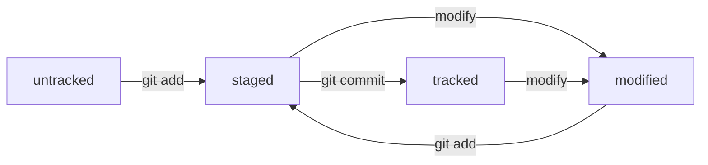

# Шпаргал по Git'у

## Схема изменения статусов файлов в Git-репозитории

```mermaid
graph LR;
	untracked -- "git add" --> staged;
	staged -- "git commit" --> tracked;
	staged -- "modify" --> modified;
	tracked -- "modify" --> modified;
	modified -- "git add" --> staged;
```